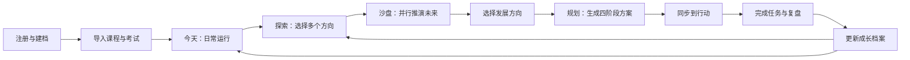
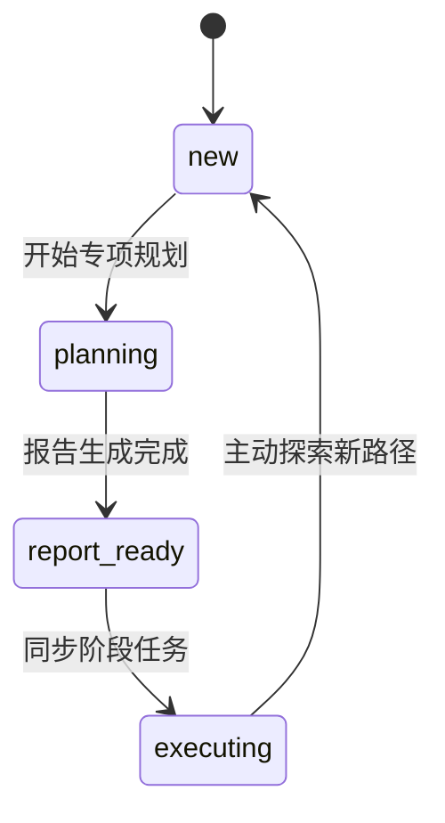

# iCampus V2 前端完整构建方案

> 文档状态：开发草案<br>
> 适用项目：iCampus 微信小程序<br>
> 最后更新：2026-08-13<br>
> 技术范围：原生微信小程序 JavaScript / WXML / WXSS<br>
> 后端范围：复用现有 FastAPI 接口，不以重写后端为前置条件

## 1. 文档目的

本文档用于指导 iCampus V2 前端重构，覆盖产品链路、信息架构、视觉规范、19 个页面、公共组件、请求层、状态管理、数据可视化、迁移顺序、排期和验收标准。

本文档不是单纯的视觉改版说明。V2 的目标是把当前“校园工具集合”重构为一套完整的大学生成长决策与执行系统：

> 帮助大学生看清选择、生成计划，并把长期目标落实到今天。

相关文档：

- [现有前端设计规范](./frontend-design-spec.md)
- [现有前端 API 参考](./frontend-api-reference.md)
- [iCampus PRD V2](./iCampus-PRD-v2.md)
- [现有小程序路由](../miniprogram/app.json)
- [沙盘结果数据结构](../backend/sandbox/schemas.py)
- [成长报告统一结构](../backend/planning/base.py)

## 2. 当前问题与重构结论

### 2.1 当前问题

当前小程序已经注册 19 个页面，但仍存在以下结构性问题：

1. “首页”和“今日”定位重叠，用户不知道哪个才是默认工作台。
2. “成长”同时承担路径探索、AI 对话、规划报告和执行进度，链路不清晰。
3. AI 被包装成独立功能入口，没有自然进入具体用户任务。
4. 页面各自维护样式和请求，缺少公共组件与领域 Service。
5. 沙盘结果页没有充分呈现后端已经返回的路径投影、比较矩阵、关系分析和不确定性数据。
6. 规划报告仍以长文本为主，没有形成“报告 → 同步任务 → 执行 → 反馈”的可视化闭环。
7. 页面视觉依赖圆角卡片、蓝紫渐变和装饰性科技元素，缺乏统一且高级的产品语言。

### 2.2 重构结论

V2 采用以下原则：

- 保持原生微信小程序技术栈，不在比赛周期内迁移 Taro、uni-app 或其他框架。
- 复用现有后端 API，通过前端信息架构和数据表达提升产品完成度。
- 将底部导航改为“今天 / 探索 / 行动 / 我的”。
- 删除独立 AI 首页，AI 能力进入今日建议、沙盘、专项规划和成长教练四个场景。
- 将当前多模式 `chatroom` 拆分为沙盘对话、规划对话和成长教练三个页面。
- 使用“编辑式数据产品”视觉方向，依靠排版、轨迹、数字和图表形成视觉冲击，不使用廉价赛博科技风。
- 新页面并行开发，完成联调后统一切换路由，最后移除旧页面。

## 3. 产品核心链路



比赛演示必须优先保证以下三分钟链路：

```text
选择三条路径
→ 完成沙盘问答
→ 查看未来轨迹和雷达对比
→ 选择一个方向
→ 生成四阶段规划
→ 同步第一阶段
→ 完成一项任务
→ 执行进度变化
→ AI教练读取执行状态
→ 成长护照展示真实记忆
```

## 4. V2 信息架构

### 4.1 底部导航

| Tab | 用户核心问题 | 页面定位 | 主要数据 |
|---|---|---|---|
| 今天 | 我现在应该做什么？ | 每日驾驶舱 | 今日概览、时间线、月历、AI建议 |
| 探索 | 我未来应该怎么选？ | 成长决策实验室 | 路径、沙盘、规划状态、最新报告 |
| 行动 | 长期计划执行得怎么样？ | 任务作战台 | 计划进度、阶段任务、Todo、教练 |
| 我的 | AI对我了解多少？ | 成长护照 | 用户资料、记忆、报告历史 |

### 4.2 V2 路由

V2 控制在 19 个实际路由。高频轻操作统一使用底部面板，不为每个编辑动作创建页面。

```text
主包
├─ pages/launch/index
├─ pages/auth/login/index
├─ pages/auth/register/index
├─ pages/onboarding/index
├─ pages/agreement/index
├─ pages/today/index              Tab
├─ pages/explore/index            Tab
├─ pages/action/index             Tab
├─ pages/passport/index           Tab
└─ pages/settings/index

pkg-today
├─ import/index
└─ import-preview/index

pkg-growth
├─ sandbox-chat/index
├─ sandbox-result/index
├─ planner-chat/index
├─ report/index
├─ coach/index
└─ history/index

pkg-profile
└─ memory/index
```

以下功能使用公共底部面板：

- `weather-sheet`：天气详情和城市选择。
- `event-detail-sheet`：课程、考试、待办详情。
- `course-editor-sheet`：新增和编辑课程。
- `exam-editor-sheet`：新增和编辑考试。
- `todo-editor-sheet`：新增和编辑待办。
- `profile-editor-sheet`：编辑用户基本资料。
- `confirm-sheet`：退出、删除、取消计划任务等确认操作。

### 4.3 旧页面迁移关系

| 现有页面 | V2 处理 |
|---|---|
| `pages/index` + `pages/schedule` | 合并为 `pages/today/index` |
| `pages/weather` | 改为 `weather-sheet` |
| `pages/ai` | 删除，能力进入具体场景 |
| `pages/growth` | 重构为 `pages/explore/index` |
| `pages/tasks` | 重构为 `pages/action/index` |
| `pages/profile` | 重构为 `pages/passport/index` |
| `pages/chatroom` | 拆为 sandbox-chat、planner-chat、coach |
| `pages/sandbox-result` | 重构为数据可视化结果页 |
| `pages/report` | 重构为行动路线图 |
| `pages/import` + `pages/preview` | 移入 `pkg-today` 分包 |
| `pages/memory` + `pages/history` | 分别移入 profile/growth 分包 |
| `pages/logout` | 删除，退出和销户放到设置页 |
| 未注册的 `pages/mine` | 删除或停止维护 |

## 5. 视觉与交互规范

### 5.1 视觉方向

V2 采用“编辑式数据产品”视觉方向：安静、克制、可信、具有明确的信息层级。视觉冲击来自大数字、非对称网格、留白、轨迹和数据关系，而不是霓虹、粒子和玻璃拟态。

### 5.2 设计 Token

```css
/* Canvas */
--color-canvas: #F3F1EC;
--color-surface: #FCFBF8;
--color-ink: #151515;
--color-text-secondary: #62615D;
--color-line: #D8D6D0;

/* Semantic */
--color-primary: #2F5BFF;
--color-danger: #FF4D36;
--color-success: #087E5B;
--color-warning: #D97706;

/* Spacing */
--space-1: 8rpx;
--space-2: 16rpx;
--space-3: 24rpx;
--space-4: 32rpx;
--space-5: 48rpx;
--page-gutter: 32rpx;

/* Shape */
--radius-small: 8rpx;
--radius-medium: 16rpx;
--border-default: 1rpx solid #D8D6D0;
```

### 5.3 字体层级

| 类型 | 建议字号 | 使用场景 |
|---|---:|---|
| 核心数字 | 72～108rpx | 进度、日期、关键指标 |
| 页面主标题 | 44～52rpx | 今天、探索、行动、我的 |
| 模块标题 | 30～34rpx | 路径对比、今日任务 |
| 正文 | 27～29rpx | 内容说明、任务标题 |
| 数据标签 | 22～24rpx | 图表、状态、来源 |
| 辅助信息 | 20～22rpx | 时间、更新时间、解释文本 |

### 5.4 禁止事项

- 禁止使用 Emoji 作为功能图标。
- 禁止使用紫色霓虹、发光球、星空、粒子、网格地面。
- 禁止使用 3D 饼图、拟物仪表盘和不可解释的装饰图表。
- 禁止满屏圆角卡片和大面积阴影。
- 禁止不同智能体各自使用一套不一致的页面视觉。
- 禁止显示后端没有依据的成功率、排名和成长预测百分比。

### 5.5 动效规范

| 场景 | 时长 | 说明 |
|---|---:|---|
| 按钮和选项反馈 | 120～180ms | 颜色、位移或透明度变化 |
| 面板展开 | 180～240ms | 从底部进入，不使用弹跳 |
| 页面内容进入 | 220～300ms | 只对主要层级做轻微错峰 |
| 图表形态过渡 | 400～600ms | 路径切换、雷达图切换 |
| 计划编译过程 | 3～5s | 仅首次生成完整播放 |

设置页必须提供“减少动态效果”选项。开启后取消轨迹绘制和错峰进入，仅保留必要状态变化。

## 6. 页面详细构建规范

### 6.1 启动页 `pages/launch/index`

#### 页面目标

完成身份恢复、用户状态验证和首个路由决策。

#### 页面结构

- 左上角 iCampus 字标。
- 中心文案“让成长变得可见”。
- 三节点加载轨迹。
- 网络异常时显示内联状态，不弹连续 Toast。

#### 数据与逻辑

1. 读取本地 `token`、`userId` 和 `userInfo`。
2. 无身份信息时进入登录页。
3. 有身份信息时请求 `GET /api/v1/users/{user_id}`。
4. 返回 401 时清空身份并进入登录页。
5. 用户缺少学校、专业或年级时进入 onboarding。
6. 其他情况 `reLaunch` 到今天页。

后端没有 onboarding 完成字段，因此使用本地 `onboarding_v2_complete`。用户基本资料仍以服务端结果为准。

#### 页面状态

- `checking-auth`
- `checking-profile`
- `offline-cached`
- `error`

### 6.2 登录页 `pages/auth/login/index`

#### 页面结构

- 品牌标题和简短价值主张。
- 学号输入框。
- 密码输入框和显隐按钮。
- 主按钮“进入 iCampus”。
- 次入口“创建账号”。
- 用户协议和隐私说明入口。

#### API

`POST /api/v1/users/login`

请求体：

```json
{
  "student_id": "string",
  "password": "string"
}
```

#### 成功流

保存 `token`、`user_id` 和 `user`，判断 onboarding 状态，使用 `wx.reLaunch` 跳转，避免返回登录页。

#### 交互要求

- 请求期间禁用重复提交。
- 登录错误显示在表单附近。
- 网络错误和账号错误使用不同提示。
- 输入框完成后允许键盘提交。

### 6.3 注册页 `pages/auth/register/index`

#### 页面结构

注册分两步完成。

第一步“创建身份”：

- 姓名
- 昵称
- 学号
- 密码

第二步“建立校园档案”：

- 学校
- 学院
- 专业
- 入学年份
- 年级

#### API

`POST /api/v1/users`

注册成功后后端直接返回 token 和用户对象，前端保存身份并进入 onboarding。

#### 校验

- 密码至少 6 位。
- 姓名、学号、密码为必填项。
- 学校、专业等允许稍后补充，但必须明确提示资料会影响推荐质量。

### 6.4 新用户引导页 `pages/onboarding/index`

#### 页面目标

让用户在第一次进入时产生真实数据，而不是浏览功能介绍轮播。

#### 第一步：完善资料

显示注册时已经填写的资料，补充缺失字段。

API：`PUT /api/v1/users/{user_id}`

#### 第二步：导入校园数据

提供“导入课程表”“导入考试安排”“稍后再说”。选择导入时进入 `pkg-today/import/index`。

#### 第三步：选择关注方向

调用 `GET /api/v1/sandbox/paths`，展示后端真实支持的路径，最多选择三项。

完成按钮：

- “先进入首页”：保存本地 onboarding 完成状态并进入今天页。
- “开始探索”：调用 `POST /api/v1/sandbox/start`，携带选择的 paths，进入沙盘对话页。

### 6.5 用户协议页 `pages/agreement/index`

#### 页面目标

统一展示用户协议和隐私政策。

#### 路由参数

- `type=user`：用户协议。
- `type=privacy`：隐私说明。

#### 页面要求

- 显示文档标题、更新时间和正文目录。
- 隐私说明必须解释 AI 记忆、数据来源、编辑和删除权。
- 不使用额外 API。
- 注册页和设置页共用该页面。

### 6.6 今天页 `pages/today/index`

#### 页面目标

用户在三秒内看清下一件重要事项、今天的日程和长期计划是否已经落到行动。

#### 页面结构

1. 日期、问候语和紧凑天气入口。
2. 课程数、待办数、最近考试三个指标。
3. 下一关键行动。
4. 纵向今日时间轨迹。
5. 成长计划缩略进度。
6. 七日事件量。
7. AI 今日建议。
8. 浮动新增按钮。

#### 首屏请求

```js
Promise.allSettled([
  todayService.getOverview(userId, city),
  todayService.getTimeline(userId, date),
  growthService.getDashboard(userId),
  todoService.getTodos(userId, "all")
]);
```

主内容可操作后，再请求 `POST /api/v1/today/suggestion`。AI 建议失败不能影响日程显示。

#### 今日时间轨迹

数据来自 `GET /api/v1/today/timeline`。

| event_type | 视觉表示 | 操作 |
|---|---|---|
| course | 黑色标题、普通节点 | 查看/编辑课程 |
| exam | 红色标记 | 查看/编辑考试 |
| todo | 蓝色节点 | 完成/编辑/删除 |
| ai_plan | 绿色或蓝色节点并显示来源 | 完成/取消/进入计划 |

课程和考试不能因为时间已经过去而被前端标记为“已完成”。

#### 今日完成率

只统计今天截止的 Todo：

```text
今天已完成的待办数 / 今天全部待办数
```

当今天没有带截止时间的待办时，显示“今天暂无截止任务”，不显示 0%。

#### 月历模式

今天页顶部提供“今天 / 月历”分段切换。月历数据来自：

`GET /api/v1/today/calendar?user_id=&year=&month=`

每个日期使用小色块表示事件类型，颜色深浅只表达事件数量，不命名为压力值或负荷指数。

#### 新增操作

点击“＋”打开操作面板：

- 添加待办
- 添加课程
- 添加考试
- 导入文件

创建、编辑、删除均调用现有 Todo、Course 和 Exam CRUD API。

#### 状态

- 首次加载骨架。
- 日程为空时引导导入或添加。
- 单个模块失败时局部重试。
- 离线时展示缓存日程并禁用写操作。

### 6.7 探索页 `pages/explore/index`

#### 页面目标

根据用户当前成长状态提供唯一清晰的下一步，不展示杂乱功能入口。

#### 核心 API

`GET /api/v1/growth/dashboard/{user_id}`

#### 页面状态机



#### `new`

- 路径坐标图。
- 路径名称和简短说明。
- 主按钮“开始路径探索”。
- 历史报告入口。

路径列表来自 `GET /api/v1/sandbox/paths`。

#### `planning`

- 当前规划类型。
- 当前步骤和总步骤。
- 最后更新时间。
- 主按钮“继续规划”。

#### `report_ready`

- 最新报告摘要。
- 报告生成时间。
- 主按钮“查看并执行计划”。

#### `executing`

- 当前阶段、时间范围和完成度。
- 主按钮“查看行动”。
- 次按钮“探索其他路径”。

### 6.8 行动页 `pages/action/index`

#### 页面目标

将成长报告变成可完成、可反馈、可复盘的执行闭环。

#### 请求顺序

1. `GET /api/v1/growth/dashboard/{user_id}`。
2. 存在 `active_plan` 时调用 `GET /api/v1/today/progress`。
3. 同时请求 `GET /api/v1/todos?status=all`。

#### 有执行计划

页面从上到下包含：

1. 大型总体完成度。
2. 当前阶段和时间范围。
3. 四阶段横向路线。
4. 当前阶段任务列表。
5. 本周任务事件量。
6. AI 成长教练入口。

完成度直接使用 `overall_completion`，四阶段直接使用 `progress.phases`。

#### Todo 操作

- 创建：`POST /api/v1/todos`。
- 编辑：`PUT /api/v1/todos/{todo_id}`。
- 完成切换：`POST /api/v1/todos/{todo_id}/toggle`。
- 删除或取消：`DELETE /api/v1/todos/{todo_id}`。

完成操作采用乐观更新，接口失败时恢复原状态并显示内联错误。

#### 无执行计划

- 有报告未同步：展示“将计划加入行动”。
- 有规划进行中：展示“继续完成规划”。
- 没有规划：展示“探索成长路径”。
- 普通手动 Todo 仍正常显示和管理。

### 6.9 我的页 `pages/passport/index`

#### 页面目标

让用户理解 AI 记住了什么、当前成长方向是什么、过去做过哪些规划。

#### 并行请求

- `GET /api/v1/users/{user_id}`
- `GET /api/v1/memory/panel/{user_id}`
- `GET /api/v1/growth/reports?user_id=`

#### 页面结构

1. 姓名、专业、学校、年级。
2. 当前成长方向和最新报告。
3. AI 记忆容量，例如 `23 / 50`。
4. 记忆类型分布。
5. 最近三份规划报告。
6. 历史记录、记忆管理、设置入口。

记忆分布使用后端 `type_counts`。禁止基于记忆数量计算“AI了解程度”。

从沙盘、规划或报告页返回时，应使成长档案缓存失效并重新加载。

### 6.10 设置页 `pages/settings/index`

#### 个人资料

打开 `profile-editor-sheet`，编辑：

- 姓名
- 昵称
- 学校
- 学院
- 专业
- 年级
- 入学年份

保存调用 `PUT /api/v1/users/{user_id}`。

当前 API 不支持修改密码和上传头像，因此 V2 不提供虚假入口。

#### 本地偏好

- 城市。
- 减少动态效果。
- 是否显示 AI 今日建议。
- 默认打开今天或月历。

这些偏好只保存在本地，命名空间统一使用 `icampus_v2_*`。

#### 数据与隐私

- 查看 AI 记忆。
- 查看用户协议。
- 查看隐私说明。
- 退出登录。
- 删除账号。

退出登录只执行 `clearAuth`。删除账号才调用 `DELETE /api/v1/users/{user_id}`，并要求二次确认。

### 6.11 导入页 `pkg-today/import/index`

#### 页面结构

- 课程表 PDF。
- 考试安排 PDF。
- Excel 文件。
- 课程导入时的学期开始日期。
- 文件要求和隐私说明。

#### 前端能力

- `wx.chooseMessageFile`
- `wx.uploadFile`
- `UploadTask.onProgressUpdate`

#### API

- `POST /api/v1/today/import`
- `POST /api/v1/today/import/excel`

#### 状态流

```text
选择文件 → 上传 → 服务端解析 → 获得 import_id → 进入预览
```

上传阶段显示真实进度。服务端解析阶段只显示“正在解析”，不使用伪造百分比。

### 6.12 导入预览页 `pkg-today/import-preview/index`

#### API

- `GET /api/v1/today/import/preview?import_id=`
- `POST /api/v1/today/import/confirm`

#### 页面功能

- 按课程或考试分组。
- 全选、反选和单项选择。
- 展开查看时间、地点、周次等字段。
- 前端标记空名称、缺少日期和可识别的时间冲突。
- 确认时提交 `selected_indexes`。

当前 API 不提供逐项识别置信度，因此不能显示“AI识别可信度”。

确认成功后切回今天页，并自动显示月历模式和成功导入的数据。

### 6.13 沙盘对话页 `pkg-growth/sandbox-chat/index`

#### 页面目标

通过渐进式问答收集信息并完成多个发展路径的并行推演。

#### 阶段条

| 后端阶段 | 前端文案 |
|---|---|
| `discovery` | 认识你 |
| `path_probe` | 探索路径 |
| `parallel_sim` | 并行推演 |
| `projection` | 生成结论 |
| `completed` | 推演完成 |

#### API

- 新建：`POST /api/v1/sandbox/start`
- 对话：`POST /api/v1/sandbox/chat`
- 流式：`POST /api/v1/sandbox/chat/stream`
- 恢复：`POST /api/v1/sandbox/resume`

#### 页面结构

- 固定顶部阶段进度。
- 只保留关键消息，不堆积无意义欢迎语。
- 当前问题使用独立决策卡。
- `show_cards=true` 时使用后端 cards 渲染选项。
- 开放问题才显示文本输入框。
- 右上角提供“退出并保存”。

接口返回的 `state` 按 session_id 临时缓存。会话完成后删除本地 state。

流式接口失败时回退到普通 `/chat`，但不能自动重复提交已经发送的回答。

### 6.14 沙盘结果页 `pkg-growth/sandbox-result/index`

#### 核心 API

`GET /api/v1/sandbox/result/{session_id}?user_id=`

#### 页面结构

1. 总体对比结论。
2. 多路径未来轨迹。
3. 路径维度雷达图。
4. 路径关系。
5. 风险与不确定性。
6. 决策问题与混合策略。
7. 最终路径选择。

#### 数据映射

| 可视区域 | 后端字段 |
|---|---|
| 总体结论 | `projection_result.summary` |
| 3个月/1年/2～3年 | `projections[].time_projection` |
| 关键节点 | `key_milestones` |
| 雷达图 | `comparison_matrix.dimensions/scores` |
| 互斥/顺序/组合 | `relationship_analysis` |
| 风险 | `key_uncertainties` |
| 决策指南 | `decision_guide` |
| 适用与避坑 | `best_for/deal_breakers` |

雷达矩阵为空时退化为文字对比，不填充前端假分数。

#### 最终操作

用户选择路径后调用：

`GET /api/v1/sandbox/handoff?session_id=&path_type=&user_id=`

成功后进入专项规划页。

### 6.15 专项规划对话页 `pkg-growth/planner-chat/index`

#### 页面目标

将传统聊天页面改造成有步骤、有选择、有确认动作的规划编排器。

#### API

- 新建：`POST /api/v1/growth/start`
- 对话：`POST /api/v1/growth/chat`
- 流式：`POST /api/v1/growth/chat/stream`
- 状态：`GET /api/v1/growth/session/{session_id}`
- 消息：`GET /api/v1/growth/conversation/{session_id}`
- 更正：`POST /api/v1/growth/correct`
- 确认：`POST /api/v1/growth/approve`

#### 页面结构

- 规划类型和当前阶段。
- `current_step / total_steps`。
- 当前关键问题。
- `next_question.options` 选项按钮。
- 用户已确认信息摘要。
- 报告生成状态。
- 报告结构化预览。

报告生成完成后提供：

- “修改信息”：调用 correct。
- “确认方案”：调用 approve。
- “查看完整报告”：进入报告页。

### 6.16 规划报告页 `pkg-growth/report/index`

#### API

- `GET /api/v1/growth/report/{session_id}`
- `GET /api/v1/today/progress`
- `POST /api/v1/today/sync-plan`

#### 页面结构

1. 长期目标。
2. 当前状态。
3. 核心问题。
4. 优势证据。
5. 风险证据。
6. 四阶段行动路线。
7. 各阶段任务。
8. 同步行动区域。

优势和风险是文字数据，必须使用证据卡展示，不能画数值柱状图。

#### 同步规则

- 默认突出第一阶段同步按钮。
- 后续阶段允许用户主动同步，不自动一次性创建全部任务。
- `already_synced=true` 时显示“已加入行动”。
- 同步后重新请求 progress。
- 主按钮切换为“查看行动”。

### 6.17 AI 成长教练页 `pkg-growth/coach/index`

#### 初始化

从 `growth/dashboard` 的 `coach` 字段获取 session_id、agent 和 quick_actions。

调用 `GET /api/v1/growth/conversation/{session_id}`，前端只展示 `stage=qa` 的教练消息。

#### API

- `POST /api/v1/growth/qa`
- `POST /api/v1/growth/qa/stream`

#### 快捷操作

- 汇报进展。
- 遇到困难。
- 复盘本周。

AI 建议新增任务时先展示建议卡，用户点击“加入行动”后再调用 `POST /api/v1/todos`。AI 回复不能静默修改任务或整份计划。

### 6.18 规划历史页 `pkg-growth/history/index`

#### API

- `GET /api/v1/growth/history/{user_id}`
- `GET /api/v1/growth/reports?user_id=`

#### 页面分段

规划会话：

- 未完成会话可以继续。
- 已完成且有报告的会话可以打开报告。
- 显示规划类型、状态、步骤和更新时间。

规划报告：

- 标题。
- 摘要。
- 创建时间。
- 是否正在执行。
- 真实执行进度。

现有后端没有沙盘历史列表接口，因此本页不能单独提供完整沙盘历史。

### 6.19 AI 记忆页 `pkg-profile/memory/index`

#### API

- `GET /api/v1/memory/panel/{user_id}`
- `PATCH /api/v1/memory/panel/{user_id}/{key}`
- `DELETE /api/v1/memory/panel/{user_id}/{key}`

#### 页面结构

- 记忆容量 `total / max_capacity`。
- 记忆类型分布。
- 类型筛选。
- 记忆列表。
- 来源、置信度、重要度和更新时间。
- 编辑和删除动作。

#### 显示规则

- `confidence` 转换为百分比显示。
- `importance` 映射为高、中、低。
- `source` 必须显示。
- 删除前说明该记忆可能影响后续推荐。
- 请求 URL 中的 key 必须正确编码。

## 7. 公共组件规划

| 组件 | 职责 | 使用页面 |
|---|---|---|
| `app-header` | 自定义标题、返回、页面操作 | 全部页面 |
| `custom-tab-bar` | 四 Tab 和选中线条 | 四个主页面 |
| `metric-number` | 大数字指标 | 今天、行动、我的 |
| `trajectory-timeline` | 今日事件轨迹 | 今天 |
| `calendar-heatmap` | 月度事件分布 | 今天 |
| `path-coordinate-map` | 路径选择坐标图 | 探索、onboarding |
| `future-track` | 多路径时间推演 | 沙盘结果 |
| `radar-chart` | 路径维度对比 | 沙盘结果 |
| `phase-roadmap` | 四阶段成长路线 | 报告、行动 |
| `progress-arc` | 计划真实完成度 | 行动、我的 |
| `task-row` | 统一任务展示与操作 | 今天、行动 |
| `source-badge` | 手动、课程、AI计划来源 | 今天、行动 |
| `question-card` | 沙盘和规划问题 | 两类对话页 |
| `stream-message` | 流式 AI 内容 | 沙盘、规划、教练 |
| `memory-distribution` | 记忆类型分布 | 我的、记忆 |
| `bottom-sheet` | 详情和编辑容器 | 全局 |
| `state-view` | loading/empty/error/offline | 全局 |
| `skeleton` | 首次加载骨架 | 四主页面、报告 |
| `app-toast` | 成功和错误反馈 | 全局 |

图表实现建议：

- 雷达图放到成长分包，可使用 `echarts-for-weixin` 或轻量 Canvas 实现。
- 今日轨迹、阶段路线和日历优先用 WXML/WXSS。
- 图表组件只接收标准化 ViewModel，不在组件内部请求 API。

## 8. 前端工程结构

```text
miniprogram/
├─ app.js
├─ app.json
├─ app.wxss
├─ custom-tab-bar/
├─ components/
│  ├─ base/
│  ├─ charts/
│  ├─ growth/
│  ├─ today/
│  └─ sheets/
├─ services/
│  ├─ request.js
│  ├─ upload.js
│  ├─ stream.js
│  ├─ user-service.js
│  ├─ today-service.js
│  ├─ todo-service.js
│  ├─ sandbox-service.js
│  ├─ growth-service.js
│  └─ memory-service.js
├─ stores/
│  ├─ session-store.js
│  ├─ today-store.js
│  ├─ growth-store.js
│  └─ ui-store.js
├─ normalizers/
│  ├─ response.js
│  ├─ timeline.js
│  ├─ projection.js
│  └─ report.js
├─ styles/
│  ├─ tokens.wxss
│  ├─ typography.wxss
│  ├─ layout.wxss
│  └─ motion.wxss
├─ pages/
├─ pkg-today/
├─ pkg-growth/
└─ pkg-profile/
```

## 9. 请求层和 Service 层

### 9.1 `request.js`

职责：

- 自动附加 Authorization。
- 同时兼容 `{code,data,message}` 包装响应和沙盘原始响应。
- 统一处理 401、403、404、422、500 和网络错误。
- GET 请求失败最多重试一次。
- Mutation 不自动重试，避免创建重复任务和重复会话。
- 支持请求取消和相同 GET 去重。
- 返回统一错误结构：`{ type, status, message, retryable }`。

### 9.2 `upload.js`

职责：

- 封装 `wx.uploadFile`。
- 暴露真实上传进度。
- 支持取消上传。
- 统一解析 import_id 和错误信息。

### 9.3 `stream.js`

职责：

- 创建 Chunked Request。
- 处理 `onChunkReceived`。
- 解析 SSE event/data。
- 合并不完整 UTF-8 分片。
- 页面销毁时中止请求。
- 流式失败时允许调用方回退普通接口。

### 9.4 领域 Service

页面不得直接拼接 URL。所有请求通过以下 Service：

- `userService`：登录、注册、用户 CRUD。
- `todayService`：overview、timeline、calendar、suggestion、导入、同步和进度。
- `todoService`：Todo CRUD 和 toggle。
- `sandboxService`：paths、start、chat、resume、result 和 handoff。
- `growthService`：dashboard、agents、规划会话、报告、correct、approve 和 coach。
- `memoryService`：panel、筛选、编辑和删除。

## 10. 状态管理

继续使用原生小程序，不引入大型状态框架。实现轻量 Store 和订阅机制。

### 10.1 `session-store`

- token
- userId
- user
- authenticated
- login/logout/updateUser

### 10.2 `today-store`

- selectedDate
- viewMode: `today|calendar`
- overview
- timelineByDate
- calendarByMonth
- todos
- invalidateDate/invalidateMonth

### 10.3 `growth-store`

- dashboard
- sandboxSessionId
- sandboxState
- planningSessionId
- activeReport
- planProgress
- invalidateDashboard/invalidateProgress

### 10.4 `ui-store`

- online
- reduceMotion
- city
- suggestionEnabled
- activeSheet

## 11. 缓存与刷新策略

| 数据 | 建议缓存 | 失效条件 |
|---|---:|---|
| Today overview/timeline | 60 秒 | 添加、编辑、完成事件 |
| 月历 | 按年月缓存 | 课程、考试、Todo 变化 |
| Growth dashboard | 30 秒 | 会话、报告、同步状态变化 |
| Sandbox paths | 长缓存 | App 版本更新 |
| Sandbox state | 当前会话 | 会话完成或用户重新开始 |
| Plan progress | 30 秒 | Todo 状态变化或同步阶段 |
| Memory panel | 5 分钟 | 规划完成、编辑、删除记忆 |
| Reports | 5 分钟 | 新报告生成或计划同步 |

主 Tab 的 `onShow` 只刷新失效或过期数据，避免每次切换都全量请求。

## 12. 数据可视化真实性约束

### 12.1 可直接展示

| 可视化 | 数据来源 |
|---|---|
| 今日统一时间轨迹 | `/today/timeline` |
| 月度事件量 | `/today/calendar` |
| 路径雷达图 | `comparison_matrix` |
| 多路径未来轨迹 | `time_projection` |
| 路径互斥/互补关系 | `relationship_analysis` |
| 阶段完成度 | `/today/progress` |
| 四阶段路线图 | `progress.phases` 和 report.action_plan |
| 记忆类型分布 | `memory.type_counts` |
| 记忆置信度 | `memory.confidence` |

### 12.2 允许前端派生

- 今天截止 Todo 完成率。
- 某天、某周的事件数量。
- 不同来源任务数量。
- 当前阶段剩余任务数。

派生指标的名称必须准确，例如使用“事件量”，不能命名为“压力指数”。

### 12.3 当前禁止展示

- 考研、保研、考公或就业成功概率。
- 超过全国多少学生。
- 没有历史数据支持的能力成长曲线。
- 没有接口支持的计划收益预测。
- 自动修改整份计划的完成提示。
- 文件解析逐项置信度。
- 独立沙盘历史列表。

## 13. 性能与体验要求

### 13.1 加载

- 四个主页面首次加载使用结构化骨架，不使用全屏旋转 loading。
- AI 建议和报告摘要不得阻塞基础数据渲染。
- 使用 `Promise.allSettled`，一个模块失败不影响其他模块。
- 大型图表和成长结果页进入分包。

### 13.2 `setData`

- 不向 WXML 传递完整后端对象。
- 页面层生成 ViewModel，只传渲染所需字段。
- Todo 切换只更新目标行和汇总数字。
- 聊天列表只增量追加消息，不反复提交整个数组。

### 13.3 可用性

- 触控区域不小于微信小程序常用可点击尺寸。
- 颜色不是唯一状态表达，同时使用文本、形状或图标。
- 图表结论必须有文字摘要。
- 支持减少动态效果。
- 离线状态下允许阅读缓存内容，但禁用写操作并解释原因。

## 14. 异常状态规范

每个异步页面必须覆盖：

1. 首次加载。
2. 空数据。
3. 局部接口失败。
4. 全局网络失败。
5. 401 身份过期。
6. 用户主动取消。
7. 重试成功。

AI 页面还必须覆盖：

- 流式连接中断。
- 普通接口回退。
- 会话已完成。
- session_id 无效。
- 状态缓存与服务端不一致。
- 用户重复点击发送。

## 15. API 能力边界与前端处理

| 当前缺口 | V2 处理方式 |
|---|---|
| 无服务端 onboarding 状态 | 使用本地标志，用户资料仍以服务端为准 |
| 无服务端城市偏好 | 本地保存城市 |
| 无沙盘历史列表 | 不提供独立沙盘历史 |
| 无逐项导入置信度 | 只做字段完整性和冲突检查 |
| 无历史成长趋势 | 不画趋势图 |
| 无成功概率和群体排名 | 不展示 |
| 无完整计划自动调整接口 | AI 给建议，用户确认后修改 Todo |
| 无头像上传接口 | 不提供头像上传按钮 |
| 无密码修改接口 | 不提供密码修改入口 |

## 16. 开发与迁移计划

### 16.1 迁移原则

- 在 V2 页面完成之前保留现有页面作为回退。
- 公共请求层、Token 和组件优先开发。
- 四个新 Tab 完成后再切换 `app.json`。
- 旧页面最终从发布包移除，避免体积浪费。
- 不在同一个提交中同时大规模重命名旧页面和实现新页面。

### 16.2 18 个工作日比赛版排期

| 阶段 | 时间 | 交付内容 |
|---|---:|---|
| P0：接口冻结 | 1 天 | API 字段表、响应 Fixture、页面状态表 |
| P1：视觉和基础设施 | 2 天 | Token、请求层、Service、状态组件、TabBar |
| P2：今天与行动 | 3 天 | 时间轨迹、月历、Todo、阶段进度 |
| P3：探索与沙盘 | 4 天 | 路径选择、沙盘对话、轨迹图、雷达图 |
| P4：规划与报告 | 3 天 | 规划对话、报告、同步行动、教练 |
| P5：我的和历史 | 2 天 | 成长护照、记忆、报告历史、设置 |
| P6：登录和导入 | 1 天 | 注册、onboarding、文件预览 |
| P7：联调和视觉 QA | 2 天 | 真机、异常状态、演示脚本、性能修正 |

### 16.3 优先级

P0 必须完成：

- 请求层和 Service 层。
- 今天、探索、行动、我的四个 Tab。
- 沙盘对话和结果。
- 规划对话和报告。
- 计划同步和进度闭环。

P1 应完成：

- 导入预览。
- 成长教练。
- 记忆管理。
- 历史报告。
- 全部异常状态。

P2 可延期：

- 复杂动效。
- 更多数据图表切换形式。
- 离线缓存的高级恢复。
- 非核心设置项。

## 17. 测试方案

### 17.1 API Contract Fixture

为以下响应建立前端 Fixture：

- today overview/timeline/calendar。
- growth dashboard 四种 page_state。
- sandbox chat 五个阶段。
- sandbox result 完整、部分缺失和无 comparison_matrix。
- growth report 完整和兼容降级结构。
- plan progress 有任务、无任务、全部完成和含 cancelled。
- memory panel 满容量、空数据和多类型。

### 17.2 页面状态测试

每个页面至少验证：

- loading。
- success。
- empty。
- partial error。
- offline。
- unauthorized。

### 17.3 核心链路测试

1. 注册并进入 onboarding。
2. 导入课表并确认部分数据。
3. 开始沙盘并中途退出恢复。
4. 完成沙盘并正确展示三条路径。
5. handoff 到专项规划。
6. 完成规划并生成报告。
7. 同步第一阶段且避免重复同步。
8. 完成 Todo 后进度更新。
9. 教练能读取当前执行状态。
10. 我的页面能显示真实报告和记忆。

## 18. 页面完成定义

一个页面只有满足以下条件才算完成：

- 已接入真实 API 或正式 Fixture。
- 已实现 loading、empty、error 和 success。
- 已使用公共 Token 和公共组件。
- 没有页面内重复实现请求封装。
- 没有后端不支持的虚假指标。
- 写操作有成功反馈和失败恢复。
- 真机滚动、点击和返回行为正常。
- 支持小屏设备和安全区域。
- 文案、图标和色彩通过视觉一致性检查。

## 19. 最终验收标准

### 19.1 产品链路

以下链路必须无死路跑通：

```text
注册
→ 导入课程
→ 选择三条路径
→ 完成沙盘
→ 查看路径对比
→ 选择方向
→ 生成规划报告
→ 同步第一阶段
→ 完成一项任务
→ 进度发生变化
→ AI教练读取执行状态
→ 成长护照显示真实记忆
```

### 19.2 视觉

- 无 Emoji 功能图标。
- 无紫色霓虹、星空粒子和玻璃拟态堆叠。
- 页面主色、圆角、间距全部来自 Token。
- 图表颜色、图例和文字结论一致。
- 四个 Tab 在视觉上属于同一个产品。

### 19.3 数据真实性

- 不显示假成功率、假排名和假趋势。
- 所有数值都能映射到 API 字段或明确的前端派生规则。
- 报告中的文字优势和风险不被伪装成数值图表。
- 自动计划调整必须经过用户确认。

### 19.4 稳定性

- Todo 乐观更新失败可以回滚。
- 沙盘和规划中途退出可以恢复。
- 流式接口失败可以回退。
- 单个接口失败不会导致整个首页不可用。
- 401 能统一清理身份并返回登录页。
- 三分钟比赛演示中不出现空页、死路或必须输入长文本的步骤。

## 20. 建议开发任务拆分

### 基础设施

- [ ] 建立 styles Token。
- [ ] 拆分 request/upload/stream。
- [ ] 建立领域 Service。
- [ ] 建立四个 Store。
- [ ] 建立 response normalizer。
- [ ] 建立 loading/empty/error/offline 组件。
- [ ] 建立自定义 TabBar。

### 今天与行动

- [ ] Today overview ViewModel。
- [ ] 今日轨迹组件。
- [ ] 月历事件量组件。
- [ ] Todo CRUD 面板。
- [ ] Course/Exam 编辑面板。
- [ ] 阶段进度和路线图。
- [ ] Todo 乐观更新和回滚。

### 探索与规划

- [ ] Growth dashboard 状态首页。
- [ ] 路径坐标选择。
- [ ] 沙盘流式对话。
- [ ] 沙盘状态恢复。
- [ ] 多路径未来轨迹。
- [ ] 雷达图。
- [ ] 关系与不确定性展示。
- [ ] Handoff。
- [ ] 专项规划对话。
- [ ] Correct/Approve。
- [ ] 报告和阶段同步。
- [ ] 成长教练。

### 我的与设置

- [ ] 成长护照首页。
- [ ] 记忆分布和筛选。
- [ ] 记忆编辑和删除。
- [ ] 规划历史。
- [ ] 个人资料面板。
- [ ] 设置和隐私入口。

### 登录与导入

- [ ] 启动路由决策。
- [ ] 登录和注册。
- [ ] Onboarding。
- [ ] 文件上传进度。
- [ ] 导入预览和确认。

### QA

- [ ] API Fixture。
- [ ] 四种 Growth dashboard 状态。
- [ ] 沙盘完整/缺失数据降级。
- [ ] 弱网和流式中断。
- [ ] 真机安全区域。
- [ ] 减少动态效果。
- [ ] 三分钟演示脚本。
