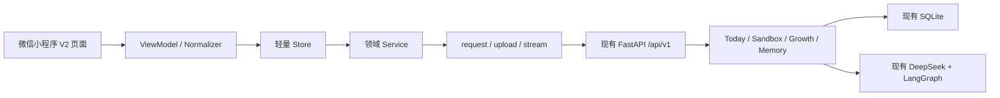
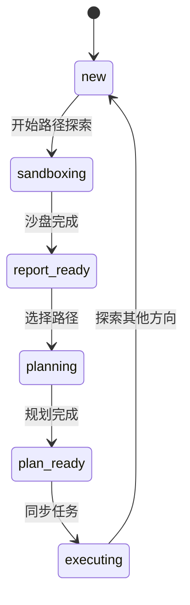

# iCampus V2 前端全量重写与后端最小改造方案

> 文档状态：实施规划<br>
> 适用目标：2026 年第二十届 iCAN 大学生创新创业大赛创新赛道<br>
> 编制日期：2026-08-13<br>
> 核心策略：前端全量重写，后端保留现有架构并做最小兼容改造<br>
> 技术栈：原生微信小程序 JavaScript / WXML / WXSS + FastAPI / SQLAlchemy / SQLite / LangGraph

## 1. 决策摘要

本轮重构不重写后端，不新建 `/api/v2`，不迁移数据库，不引入 Redis、Celery、微服务或新的前端框架。

实施边界如下：

| 范围 | 决策 |
|---|---|
| 前端页面 | 全量重写，旧页面仅作为联调回退 |
| 前端工程 | 新建 Service、Normalizer、Store、公共组件和设计 Token |
| 后端路由 | 继续使用现有 `/api/v1/*` |
| 后端业务 | 保留 Today、Sandbox、Growth、Memory 全部现有服务 |
| 数据库 | 保留 SQLite 和现有表结构，比赛版不做破坏性迁移 |
| AI 工作流 | 保留现有 LangGraph、DeepSeek、流式与非流式接口 |
| 后端改动 | 只修复数据失真、契约缺项和演示闭环问题 |

重构目标不是把现有页面换一套皮肤，而是让当前后端能力形成一个可以稳定演示、数据可解释、路径无死路的移动产品：

```text
今天看到下一步
→ 探索多个未来方向
→ 查看基于真实字段的路径对比
→ 进入专项规划
→ 将阶段任务加入行动
→ 完成任务并产生真实进度
→ AI 教练读取执行状态
→ 成长护照展示报告和记忆
```

## 2. 比赛约束与产品目标

### 2.1 iCAN 对产品的直接要求

2026 创新赛道的有效作品需要是可运行、可操作的软件系统。巡展重点考察实用性、技术创新性和现场演示效果；分组答辩重点考察创新性、实用性、原创性和技术方案。

官方方案：

- [第二十届 iCAN 大赛创新赛道方案](https://www.chinaccsis.com/Assets/userfiles/sys_eb538c1c-65ff-4e82-8e6a-a1ef01127fed/files/%E9%99%84%E4%BB%B61%EF%BC%9A%E7%AC%AC%E4%BA%8C%E5%8D%81%E5%B1%8AiCAN%E5%A4%A7%E8%B5%9B%E5%88%9B%E6%96%B0%E8%B5%9B%E9%81%93%E6%96%B9%E6%A1%88.pdf)

因此比赛版优先级为：

1. 现场操作完整和稳定。
2. 所有数字可追溯到后端字段或明确公式。
3. 路径探索、规划、执行和反馈形成真实闭环。
4. 能说明本项目与普通 AI 对话产品的差异。
5. 有开发过程、测试、用户验证和 AI 辅助标识等原创证明材料。

### 2.2 产品定位

产品一句话定位：

> iCampus 是面向大学生的成长决策与执行系统，帮助用户看清选择、生成计划，并把长期目标落实到可完成的行动。

四个主 Tab：

| Tab | 用户问题 | 产品职责 |
|---|---|---|
| 今天 | 我今天应该做什么？ | 日程、课程、考试、待办和下一关键行动 |
| 探索 | 我的未来应该怎么选？ | 多路径沙盘、专项规划和报告状态 |
| 行动 | 计划执行得怎么样？ | 阶段任务、真实完成度和 AI 教练 |
| 我的 | AI 了解我什么？ | 用户资料、记忆、报告和历史 |

### 2.3 本轮不做

- 不开发教师端。
- 不接校园统一身份认证。
- 不承诺适配所有高校课表格式。
- 不展示升学、就业、考公成功概率。
- 不展示全国排名、超越人数或无历史数据支撑的成长曲线。
- 不做自动修改整份计划。
- 不把 LLM 生成的文字伪装成统计数据。
- 不为比赛临时引入复杂基础设施。

## 3. 总体架构



核心原则：

- 页面不直接拼接 URL。
- 组件不直接请求后端。
- 后端原始对象不直接进入 WXML。
- 所有后端兼容差异在 Normalizer 中消化。
- 沙盘原始响应和 `/api/v1` 信封响应由请求层统一解包。
- 所有写操作具备防重复、失败恢复和明确反馈。

## 4. 前端全量重写方案

### 4.1 路由规划

保留 19 个实际路由；高频编辑操作使用底部面板，不继续增加页面。

```text
主包
├─ pages/launch/index
├─ pages/auth/login/index
├─ pages/auth/register/index
├─ pages/onboarding/index
├─ pages/agreement/index
├─ pages/today/index              Tab
├─ pages/explore/index            Tab
├─ pages/action/index             Tab
├─ pages/passport/index           Tab
└─ pages/settings/index

pkg-today
├─ import/index
└─ import-preview/index

pkg-growth
├─ sandbox-chat/index
├─ sandbox-result/index
├─ planner-chat/index
├─ report/index
├─ coach/index
└─ history/index

pkg-profile
└─ memory/index
```

公共底部面板：

- `weather-sheet`
- `event-detail-sheet`
- `course-editor-sheet`
- `exam-editor-sheet`
- `todo-editor-sheet`
- `profile-editor-sheet`
- `sync-plan-sheet`
- `confirm-sheet`

### 4.2 旧页面迁移

| 现有页面 | V2 处理 |
|---|---|
| `pages/index` + `pages/schedule` | 合并为今天页 |
| `pages/weather` | 改成天气底部面板 |
| `pages/ai` | 删除，AI 进入具体任务场景 |
| `pages/growth` | 重写为探索页 |
| `pages/tasks` | 重写为行动页 |
| `pages/profile` | 重写为成长护照 |
| `pages/chatroom` | 拆为沙盘、规划、教练三个页面 |
| `pages/sandbox-result` | 重写为结构化路径对比 |
| `pages/report` | 重写为四阶段行动路线 |
| `pages/import` + `pages/preview` | 移入 Today 分包 |
| `pages/memory` + `pages/history` | 移入 Profile/Growth 分包 |
| `pages/logout` + `pages/mine` | 删除 |

### 4.3 页面与现有后端契约

| 页面 | 核心接口 | 前端处理 |
|---|---|---|
| 启动 | `GET /api/v1/users/{id}` | 身份恢复、资料缺失判断 |
| 登录/注册 | `/api/v1/users/login`、`/api/v1/users` | 保存 token/userId/user |
| Onboarding | 用户更新、沙盘 paths/start | 完成资料、导入和路径选择 |
| 今天 | today overview/timeline/calendar、todos | 并行请求、局部失败、ViewModel 聚合 |
| 探索 | growth dashboard、sandbox paths | 按 `page_state` 只显示一个主动作 |
| 行动 | growth dashboard、today progress、todos | 真实计划进度与任务操作 |
| 我的 | user、memory panel、growth reports | 成长护照和报告中心 |
| 沙盘对话 | sandbox start/chat/stream/resume | 阶段恢复、卡片回答、流式降级 |
| 沙盘结果 | sandbox result | 解析嵌套 `projection_result` |
| 专项规划 | growth start/chat/stream/session | 使用 `sandbox_session_id` 继承上下文 |
| 规划报告 | growth report、today sync-plan/progress | 分阶段同步，不重复同步 |
| 教练 | growth conversation、qa/qa-stream | 读取执行状态，用户确认新增任务 |
| 记忆 | memory panel PATCH/DELETE | 显示来源、置信度、重要度 |
| 导入 | today import/import-excel/preview/confirm | 上传真实进度、解析等待、选择确认 |

### 4.4 今天页

首屏目标：三秒内看清下一件重要事项。

页面结构：

1. 日期、问候和天气。
2. 今日课程、今日截止任务、最近考试。
3. 下一关键行动。
4. 今日时间轨迹。
5. 当前成长计划缩略状态。
6. 七日事件量。
7. AI 今日建议。
8. 新增按钮。

数据规则：

- 今日完成率只统计今天截止的 Todo。
- 没有今天截止的 Todo 时不显示 `0%`，显示“今天暂无截止任务”。
- 课程只有节次、没有可靠时钟时，显示“第 1-2 节”，不生成虚假时间。
- 课程和考试不使用“已完成”状态。
- AI 建议失败不影响基础日程。
- 月历色块表示事件数量，不命名为压力或负荷。

### 4.5 探索页

探索页不是功能宫格，而是状态驱动首页。



现有 `growth/dashboard` 只负责专项规划状态；沙盘进行中状态由本地 `sandboxSessionId + state` 恢复，不要求后端新增沙盘历史接口。

### 4.6 沙盘结果页

页面结构：

1. 总体结论。
2. 各路径核心洞察。
3. 三个月、一年、两到三年的文字里程碑轨迹。
4. 路径维度雷达图。
5. 互斥、顺序和互补关系。
6. 风险与不确定性。
7. 决策问题和混合策略。
8. 选择最终路径。

严格数据约束：

- `time_projection` 是文字，使用节点时间线，不画数值折线。
- `comparison_matrix` 是 1-10 分，雷达图按 10 分制展示。
- “匹配度”显示为 `8/10` 或“较高”，不包装成成功概率。
- 矩阵缺失时退化成文字对比，不填默认假分数。
- 不使用视觉稿中的 68→76→88 等无依据曲线。

路径选择后的正式调用链：

```text
用户选择路径
→ POST /api/v1/growth/start
→ body 带 user_id、agent、sandbox_session_id
→ 获得 Growth session_id
→ 进入 planner-chat
```

V2 前端不依赖 `/sandbox/handoff` 返回的临时 `agent_state`，避免形成两套规划状态。

### 4.7 行动页

页面结构：

1. 总体完成度。
2. 当前阶段与时间范围。
3. 四阶段路线。
4. 当前阶段任务。
5. 本周任务事件量。
6. AI 成长教练。

比赛版不展示后端没有的数据：

- 不显示“预计 60 分钟”。
- 不显示分钟级工作负载。
- 不显示能力成长百分比。
- 没有任务工时字段时，只显示任务数量和完成情况。

计划完成率口径沿用后端：

```text
completed / total
```

后端返回为 `0~1`，Normalizer 转换成 `0~100` 的展示百分比。

### 4.8 我的页

成长护照展示：

- 基本资料。
- 当前成长方向。
- 最新规划报告。
- 记忆容量 `total / max_capacity`。
- 记忆类型分布。
- 最近三份报告。
- 历史、记忆管理和设置入口。

禁止根据记忆数量计算“AI 了解程度”。记忆数量只表达已经保存的条目数。

### 4.9 前端工程结构

```text
miniprogram/
├─ app.js
├─ app.json
├─ app.wxss
├─ custom-tab-bar/
├─ components/
│  ├─ base/
│  ├─ charts/
│  ├─ growth/
│  ├─ today/
│  └─ sheets/
├─ services/
│  ├─ request.js
│  ├─ upload.js
│  ├─ stream.js
│  ├─ user-service.js
│  ├─ today-service.js
│  ├─ todo-service.js
│  ├─ sandbox-service.js
│  ├─ growth-service.js
│  └─ memory-service.js
├─ normalizers/
│  ├─ response.js
│  ├─ today.js
│  ├─ projection.js
│  ├─ progress.js
│  └─ report.js
├─ stores/
│  ├─ session-store.js
│  ├─ today-store.js
│  ├─ growth-store.js
│  └─ ui-store.js
├─ styles/
│  ├─ tokens.wxss
│  ├─ typography.wxss
│  ├─ layout.wxss
│  └─ motion.wxss
├─ fixtures/
├─ pages/
├─ pkg-today/
├─ pkg-growth/
└─ pkg-profile/
```

比赛周期继续使用原生 JavaScript，暂不迁移 TypeScript、Taro 或 uni-app。

### 4.10 请求层

`request.js`：

- 自动附加 Bearer Token。
- 兼容 `/api/v1` 信封响应和 Sandbox 原始响应。
- 统一错误为 `{type, status, code, message, retryable}`。
- GET 网络失败最多重试一次。
- Mutation 不自动重试。
- 相同 GET 去重。
- 401 统一清理身份并进入登录页。
- 页面卸载时支持取消请求。

`stream.js`：

- 封装 `enableChunked` 和 `onChunkReceived`。
- 合并不完整 UTF-8 分片。
- 解析 SSE event/data。
- 流式失败时允许调用普通接口。
- 已经成功提交的用户回答不得重复提交。

`upload.js`：

- 封装 `wx.uploadFile`。
- 只把上传过程显示为百分比。
- 服务端解析阶段显示“正在解析”，不用伪百分比。
- 支持取消和超时。

### 4.11 Store 与刷新

| Store | 状态 |
|---|---|
| session | token、userId、user、authenticated |
| today | selectedDate、viewMode、overview、timeline、calendar、todos |
| growth | dashboard、sandboxSession、planningSession、report、progress |
| ui | online、city、reduceMotion、suggestionEnabled、activeSheet |

缓存策略：

| 数据 | 缓存 | 失效条件 |
|---|---:|---|
| Today overview/timeline | 60 秒 | 事件或 Todo 变化 |
| 月历 | 按月 | 课程、考试、Todo 变化 |
| Growth dashboard | 30 秒 | 会话、报告、同步变化 |
| Sandbox paths | 长缓存 | 应用版本变化 |
| Sandbox state | 当前会话 | 完成或重新开始 |
| Progress | 30 秒 | Todo 状态或阶段同步变化 |
| Memory | 5 分钟 | 规划完成、编辑或删除 |
| Reports | 5 分钟 | 新报告或执行状态变化 |

### 4.12 公共组件

| 组件 | 主要职责 |
|---|---|
| `app-header` | 自定义导航和操作 |
| `custom-tab-bar` | 四个主 Tab |
| `metric-number` | 有口径说明的大数字 |
| `trajectory-timeline` | 今日事件轨迹 |
| `calendar-heatmap` | 月度事件量 |
| `path-coordinate-map` | 路径选择 |
| `milestone-track` | 文字未来里程碑，不接数值纵轴 |
| `radar-chart` | 1-10 分路径维度对比 |
| `phase-roadmap` | 四阶段计划 |
| `progress-arc` | 真实任务完成度 |
| `task-row` | 任务展示和操作 |
| `source-badge` | 手动、课程、导入、AI 计划来源 |
| `question-card` | 沙盘和规划的选择题/开放题 |
| `stream-message` | 流式内容 |
| `memory-distribution` | 记忆类型数量 |
| `bottom-sheet` | 编辑、详情和确认 |
| `state-view` | loading/empty/error/offline |
| `skeleton` | 首屏骨架 |

## 5. 视觉系统

采用“编辑式数据产品”方向：克制、可信、信息密度高但不拥挤。

```css
--color-canvas: #F3F1EC;
--color-surface: #FCFBF8;
--color-ink: #151515;
--color-text-secondary: #62615D;
--color-line: #D8D6D0;
--color-primary: #2F5BFF;
--color-danger: #FF4D36;
--color-success: #087E5B;
--color-warning: #D97706;

--space-1: 8rpx;
--space-2: 16rpx;
--space-3: 24rpx;
--space-4: 32rpx;
--space-5: 48rpx;
--page-gutter: 32rpx;

--radius-small: 8rpx;
--radius-medium: 16rpx;
```

视觉稿的使用方式：

- 作为答辩 PPT、展示大屏和产品故事总览。
- 不直接压缩成手机四栏页面。
- A 今天、B 探索、C 路径推演、D 行动拆到独立移动页面。
- 我的/成长护照作为第五个故事模块补充到答辩材料。

## 6. 后端最小改造方案

### 6.1 完全保留

- `backend/app/api/v1` 路由结构。
- `TodayService`、`GrowthService`、`DecisionSandbox`、`MemoryService`。
- SQLAlchemy ORM 和 SQLite。
- 现有用户、课程、考试、Todo、PlanTask、GrowthReport、Memory 表。
- 现有 JWT 鉴权和访问控制。
- LangGraph 工作流和现有 Prompt。
- 现有流式、非流式及降级路径。
- 现有文件导入和预览机制。

### 6.2 P0：必须修改

#### B1. 修复 Today overview 天气城市失真

现状：接口接受 `city`，但使用固定北京坐标。

修改：

- 把 `weather.py` 的坐标解析和天气映射抽成可复用函数。
- `today/overview.py` 调用同一函数。
- 失败时 `weather=null`，不伪装成用户城市天气。

影响文件：

- `backend/app/api/v1/weather.py`
- `backend/app/api/v1/today/overview.py`
- 对应测试

不改数据库，不改接口路径。

#### B2. 冻结并测试现有关键接口契约

为以下接口增加完整/缺失/空数据 Fixture 和契约测试：

- today overview/timeline/calendar
- growth dashboard 四种状态
- sandbox paths/chat/result
- growth start/chat/report/reports
- today sync-plan/progress
- memory panel

重点锁定：

- `/api/v1` 信封与 Sandbox 原始响应差异。
- `overall_completion` 为 `0~1`。
- `comparison_matrix` 为 `1~10`。
- `time_projection` 为文字。
- `active_plan.progress` 为 `0~1`。

### 6.3 P1：小范围增强

#### B3. 计划同步支持可选开始日期

现有 Todo 已有 `deadline`，不新增数据库字段。

在 `SyncPlanRequest` 中增加可选字段：

```json
{
  "user_id": "...",
  "growth_session_id": "...",
  "phase": "phase_1",
  "start_date": "2026-08-17"
}
```

规则：

- 任务本身已有 deadline 时保留。
- 没有 deadline 且传入 `start_date` 时，按阶段周期均匀分布截止日期。
- 没有 `start_date` 时维持现有行为，不破坏旧前端。
- 前端同步面板默认今天，可让用户确认。

该增强让“加入行动”更接近真实执行计划，但不要求添加工时字段。

### 6.4 本轮明确不改

- 不删除 `/sandbox/handoff`，但 V2 前端不使用它。
- 不修改 `/sandbox/paths`；路径说明属于固定产品文案，由前端 Normalizer 按 `type` 补齐。
- 不新增沙盘历史列表接口。
- 不改 Growth report 总体结构。
- 不把 `time_projection` 改成数字。
- 不增加成功概率算法。
- 不增加 Todo 工时字段。
- 不重写导入器；前端明确展示已适配格式。
- 不新增服务端 onboarding 字段。
- 不改为 PostgreSQL。
- 不引入队列和 Redis。

### 6.5 后端改动预算

| 任务 | 预计代码影响 | 风险 |
|---|---:|---|
| 天气复用与修复 | 2 个业务文件 + 测试 | 低 |
| API Fixture/契约测试 | 测试与文档 | 低 |
| sync start_date | Schema/TodayService + 测试 | 中低 |

后端总改动应控制在 4 个业务文件附近；超过此范围需要重新评估是否应由前端降级表达解决。

## 7. 数据真实性口径

### 7.1 可展示数字

| 指标 | 公式/字段 |
|---|---|
| 今日课程数 | `overview.courses_count` |
| 今日待办数 | `overview.todos_count` 或前端筛选 |
| 最近考试 | `overview.nearest_exam` |
| 今日完成率 | 今日截止 Todo 中 `done / total` |
| 计划完成率 | `progress.overall_completion × 100` |
| 记忆容量 | `memory.total / memory.max_capacity` |
| 雷达分值 | `comparison_matrix.scores`，1-10 |
| 本周事件量 | 日历/任务按日期计数 |

### 7.2 只能展示为文字

- 三个月、一年、两到三年的路径推演。
- 优势和风险。
- 路径关系。
- 决策问题。
- 报告摘要。
- AI 教练建议。

### 7.3 禁止展示

- 86% 保研成功率。
- 68→76→88 的未来成长分数。
- 超过全国 80% 学生。
- 没有工时字段时的周工作负载。
- 没有时长字段时的预计 60 分钟。
- 记忆数量推导的 AI 了解程度。

## 8. 前后端联调规则

### 8.1 响应解包

```js
function unwrapResponse(raw) {
  if (raw && typeof raw === "object" && "code" in raw) {
    if (raw.code !== 0) throw normalizeApiError(raw);
    return raw.data;
  }
  return raw;
}
```

Sandbox 原始响应必须同样通过 Service，不允许页面单独判断。

### 8.2 ViewModel 规则

- 页面只使用稳定字段。
- 所有缺失字段提供语义正确的降级值。
- 缺分数时隐藏图表，不使用默认 50 分。
- 缺天气时显示“天气暂不可用”，不显示缓存城市的实时文案。
- 缺截止日期时任务显示“未安排日期”。
- `0`、空数组和接口失败必须区分。

### 8.3 写操作

- Todo toggle 使用乐观更新，失败回滚。
- sync-plan 使用接口幂等结果，`already_synced` 时不重复创建。
- 沙盘/规划发送期间禁用重复提交。
- AI 建议创建任务必须由用户点击确认。
- 删除 AI 计划任务按后端语义显示为“取消执行”，不写“永久删除”。

## 9. 迁移与切换

### 9.1 并行建设

新页面使用新的路由目录，旧页面保持可运行：

```text
旧：pages/index/index
新：pages/today/index
```

开发期间不修改旧 TabBar。通过开发入口或临时编译条件进入 V2。

### 9.2 切换顺序

1. 建立 Token、请求层、Service、Normalizer。
2. 完成四个新 Tab 和自定义 TabBar。
3. 完成沙盘、规划、报告和行动闭环。
4. 完成登录、Onboarding、导入和设置。
5. 全链路联调。
6. 一次性切换 `app.json` 和 TabBar。
7. 保留旧页面一个回退标签。
8. 比赛版稳定后移除旧路由和未使用资源。

### 9.3 回退

- 切换前创建 Git tag。
- 新前端出现 P0 故障时，只回退 `app.json` 和 TabBar，不回滚后端兼容修复。
- 后端新增字段全部向后兼容，旧前端可以忽略。

## 10. 测试与验收

### 10.1 前端契约 Fixture

必须提供：

- Today：正常、空日程、天气失败、局部失败。
- Calendar：跨月、无事件、多类型事件。
- Growth dashboard：new/planning/report_ready/executing。
- Sandbox：五阶段、矩阵缺失、路径缺失、流式中断。
- Report：完整、旧格式降级、无 action_plan。
- Progress：未同步、部分完成、全部完成、含 cancelled。
- Memory：空、满容量、多类型和特殊字符 key。

### 10.2 核心自动化链路

```text
登录
→ Today 加载
→ 选择三条路径
→ 沙盘中途退出并恢复
→ 完成沙盘
→ 查看文字轨迹和雷达
→ 选择路径并 start Growth
→ 完成规划并生成报告
→ 同步第一阶段
→ 完成一个 Todo
→ overall_completion 变化
→ 教练读取当前进度
→ 我的显示报告和真实记忆
```

### 10.3 异常场景

- 无网络。
- 弱网和超时。
- 401/403。
- LLM 流式中断。
- 普通接口回退。
- session_id 失效。
- 重复发送。
- 重复同步。
- Todo 乐观更新失败。
- 导入文件格式错误。
- 页面返回后的缓存失效。

### 10.4 完成定义

页面满足以下条件才算完成：

- 接入真实接口或正式 Fixture。
- 覆盖 loading/empty/error/success/offline。
- 使用公共 Token、Service 和 Normalizer。
- 没有虚假指标。
- 写操作失败可恢复。
- 小屏和安全区域可用。
- 返回、滚动、输入和键盘行为正常。
- 真机测试通过。

## 11. 比赛演示设计

### 11.1 演示账户

准备匿名演示账户：

- 不显示学校、指导老师或单位名称。
- 已有基础资料、课程、考试和三路径沙盘结果。
- 已生成一份规划报告，但第一阶段尚未同步。
- 演示开始前校验 token、网络、后端健康和关键数据。

演示账户不是伪造功能。其数据由真实产品流程预先生成，现场只避免等待多轮 LLM。

### 11.2 三分钟脚本

| 时间 | 演示内容 |
|---:|---|
| 0:00-0:20 | 一句话问题和价值主张 |
| 0:20-0:45 | 今天页：下一行动、课程和考试 |
| 0:45-1:20 | 沙盘结果：文字未来轨迹、雷达、风险 |
| 1:20-1:45 | 选择路径并展示四阶段报告 |
| 1:45-2:15 | 同步第一阶段到行动 |
| 2:15-2:35 | 完成任务，进度即时变化 |
| 2:35-2:50 | AI 教练读取执行状态 |
| 2:50-3:00 | 成长护照与闭环总结 |

现场不完整跑多轮沙盘和报告生成；完整生成过程放在实物演示视频中。

### 11.3 备用方案

- 预先缓存 Today 和报告只读数据。
- 保留普通非流式接口按钮。
- 准备录屏作为网络故障备用，但现场优先操作真实系统。
- 演示脚本中至少保留一次真实写操作和一次进度变化。

## 12. 排期

### 12.1 人力假设

若要在 2026-08-31 前完成全量前端重写，建议至少：

- 2 名前端/全栈并行开发。
- 1 名后端兼容与测试负责人，可由全栈成员兼任。
- 1 名产品/视觉/材料负责人，可由队员兼任。

单人完成全部 19 页、公共组件、联调和材料，合理周期约 25-30 个工作日，无法在当前截止日前保证质量。

### 12.2 12 个工作日比赛版

| 日程 | 前端 A | 前端 B | 后端/QA | 交付 |
|---|---|---|---|---|
| D1 | Token、排版、基础组件 | request/Service/Normalizer | 契约冻结、Fixture | 工程骨架 |
| D2 | TabBar、Today 骨架 | Store、状态组件 | 修天气 | 主框架 |
| D3 | Today 时间轨迹 | 月历、编辑面板 | Today 契约测试 | Today 可用 |
| D4 | Action 页面 | Todo/Progress/路线图 | sync start_date | 行动可用 |
| D5 | Explore dashboard | 路径选择/状态机 | dashboard Fixture | 探索入口 |
| D6 | Sandbox chat | 流式/恢复/问题卡 | Sandbox 契约测试 | 沙盘可用 |
| D7 | Sandbox result | 雷达/里程碑/风险 | 缺失数据降级测试 | 结果页 |
| D8 | Planner chat | Report/Sync sheet | Growth 契约测试 | 规划闭环 |
| D9 | Coach | Passport/Memory/History | 进度和记忆测试 | 成长闭环 |
| D10 | Auth/Onboarding | Import/Preview/Settings | 全量后端回归 | 全页面 |
| D11 | 真机与异常修复 | 视觉一致性与动效 | 端到端联调 | RC 版本 |
| D12 | 演示账户与脚本 | PPT/视频/截图 | 测试报告与标签 | 材料冻结 |

### 12.3 截止后增强

- 扩充更多高校课表解析器。
- 用户可编辑计划任务的日期和优先级。
- 增加真实用户试点和使用数据。
- 完善离线缓存。
- 将 JavaScript 渐进迁移到 TypeScript。
- 评估 PostgreSQL 和正式部署方案。

## 13. iCAN 评分映射

| 评审项 | 产品证据 |
|---|---|
| 实用性 | 课程、考试、待办、路径选择和行动同步的真实操作 |
| 技术创新性 | 多路径并行推演、跨模式记忆、结构化规划和执行反馈 |
| 演示效果 | 三分钟无死路闭环和真实进度变化 |
| 创新性 | 从聊天助手升级为决策—规划—执行系统的方法创新 |
| 原创性 | Git 历史、开发日志、架构决策、测试报告和界面迭代 |
| 技术方案 | FastAPI、LangGraph、SSE、数据契约、幂等与故障降级 |

需要额外准备：

- 5-10 名目标用户的任务测试或访谈。
- 至少一组改版前后完成时间/成功率对比。
- API 测试和 AI 对话回归报告。
- 开发日志和关键决策记录。
- 若材料使用 AI 生成或辅助，添加“AI 辅助制作”标识。
- 所有参赛材料和演示数据匿名化。

## 14. 任务拆分

### 前端基础

- [ ] 新设计 Token 和全局排版。
- [ ] request/upload/stream。
- [ ] 领域 Service。
- [ ] response/today/projection/progress/report Normalizer。
- [ ] 四个 Store。
- [ ] loading/empty/error/offline。
- [ ] 自定义 TabBar。

### 今天与行动

- [ ] Today ViewModel。
- [ ] 今日轨迹。
- [ ] 月历事件量。
- [ ] Todo/Course/Exam 面板。
- [ ] Action ViewModel。
- [ ] 四阶段路线。
- [ ] 乐观更新和回滚。
- [ ] 阶段同步面板。

### 探索与规划

- [ ] Explore 状态首页。
- [ ] 路径选择和前端路径说明映射。
- [ ] Sandbox 流式与恢复。
- [ ] 文字未来里程碑。
- [ ] 1-10 分雷达图。
- [ ] 关系、风险和不确定性。
- [ ] Growth start 携带 sandbox_session_id。
- [ ] Planner chat。
- [ ] Report/Correct/Approve。
- [ ] Coach。

### 我的与系统页

- [ ] Passport。
- [ ] Memory 管理。
- [ ] 报告历史。
- [ ] 设置和隐私。
- [ ] 登录、注册、Onboarding。
- [ ] 导入与预览。

### 后端最小改造

- [ ] 修复 Today overview 城市天气。
- [ ] 冻结关键响应 Fixture。
- [ ] 增加契约测试。
- [ ] sync-plan 可选 start_date。
- [ ] 保持现有测试全部通过。

### 比赛与 QA

- [ ] 全链路自动测试。
- [ ] 真机安全区域。
- [ ] 弱网和流式降级。
- [ ] 匿名演示账户。
- [ ] 三分钟脚本。
- [ ] 实物演示视频。
- [ ] 用户验证记录。
- [ ] 原创开发日志。
- [ ] AI 辅助标识和双盲检查。

## 15. 最终验收标准

发布比赛版前必须同时满足：

1. 四个主 Tab 均接真实后端。
2. 沙盘、规划、报告、同步、任务完成、教练和记忆链路无死路。
3. 所有百分比和图表有明确字段或公式。
4. 后端没有为视觉稿生成假数据。
5. 流式失败可以回退，Mutation 不重复执行。
6. Todo 乐观更新失败可以恢复。
7. 沙盘和规划可以中途恢复。
8. 单个模块失败不会导致整页空白。
9. 全部后端测试继续通过，新增契约测试通过。
10. 真机三分钟演示连续通过至少 5 次。
11. 演示账户、截图、PPT 和视频不出现院校及指导老师信息。
12. AI 辅助材料完成明确标识。

---

本方案的核心取舍是：把研发资源放在前端重构、契约适配、真实数据表达和现场闭环上；后端只做小而确定的修复，不用大规模技术迁移增加比赛风险。
